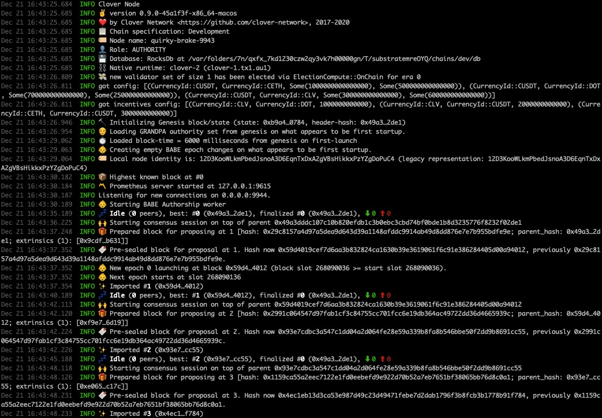
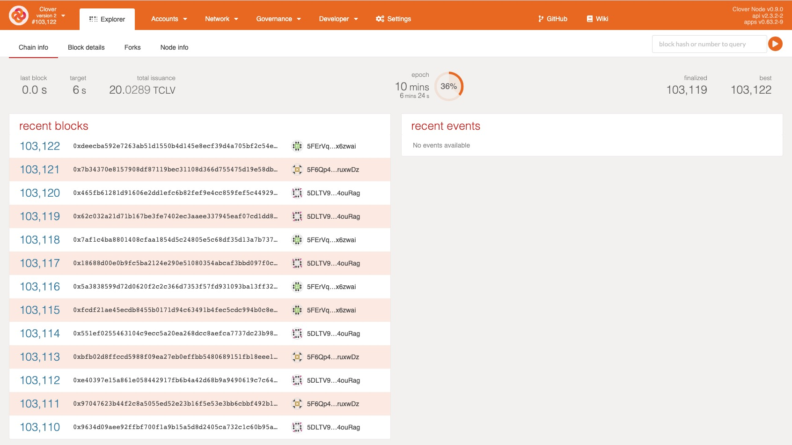
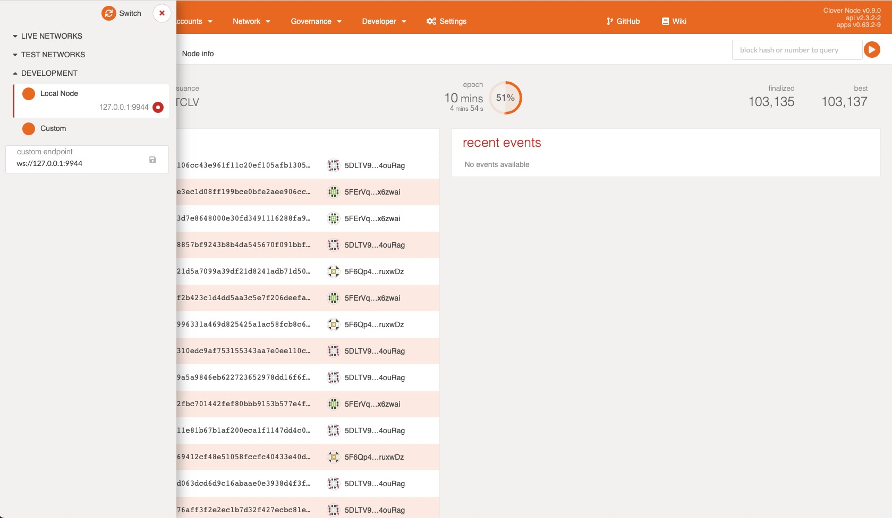
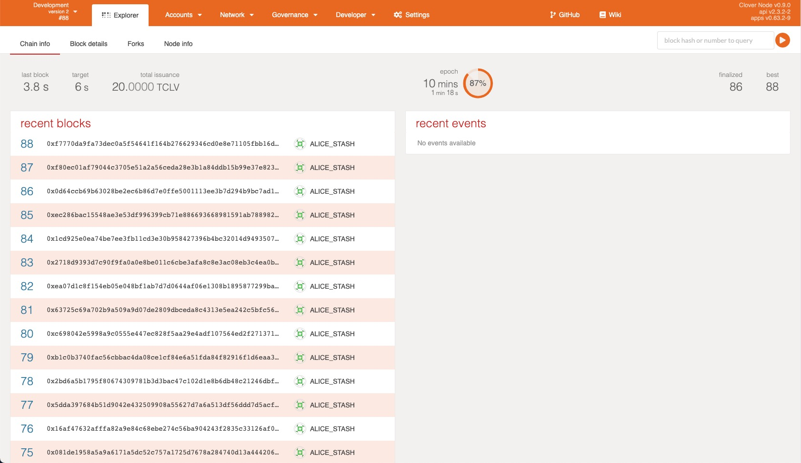

# Setting Up a Node

## 1. Install build tools & libraries <a id="__docusaurus"></a>

Clover is the easiest to be set up on Unix-based operating systems like macOS or Linux. Here is the instruction on installing Rust's toolchains. If you have already done this, please go to the Step 3.

#### macOS

Open the Terminal application and execute the following commands:

```bash
# Install Homebrew if necessary https://brew.sh/
/bin/bash -c "$(curl -fsSL https://raw.githubusercontent.com/Homebrew/install/master/install.sh)"

# Make sure Homebrew is up-to-date, install openssl and cmake
brew update
brew install openssl cmake
```

#### Ubuntu/Debian

Use a terminal shell to execute the following commands:

```bash
sudo apt update
# May prompt for location information
sudo apt install -y cmake pkg-config libssl-dev git build-essential clang libclang-dev curl
```

#### Arch Linux

Run these commands from a terminal:

```bash
pacman -Syu --needed --noconfirm cmake gcc openssl-1.0 pkgconf git clang
export OPENSSL_LIB_DIR="/usr/lib/openssl-1.0"
export OPENSSL_INCLUDE_DIR="/usr/include/openssl-1.0"
```

## 2. Install Rust toolchain

This guide uses [`rustup`](https://rustup.rs/) to help manage the Rust toolchain. First, install and configure `rustup`:

```bash
# Install
curl https://sh.rustup.rs -sSf | sh
# Configure
source ~/.cargo/env
```

## 3. Compile the node

Let's start by cloning the master branch of the Clover repo that you can find here: [https://github.com/clover-network/clover](https://github.com/clover-network/clover)

```bash
git clone git@github.com:clover-network/clover.git
cd clover
```

Once you have followed all of the steps above, it's time to build the standalone node by running:

```bash
./scripts/init.sh
cargo build --release
```


The initial build will take a while, depending on your hardware. It may take 30 minutes for the build process to complete.


## 4. Run the Node

Then you will want to run the node in dev mode using the following command:

```text
./target/release/clover --dev --rpc-cors=all  --unsafe-rpc-external  --unsafe-ws-external --validator --tmp -lruntime=debug
```

You should see an output that looks like the following, showing that blocks are being produced:




The local standalone Clover node provides two RPC endpoints:

* HTTP: `http://127.0.0.1:9933`
* WS: `ws://127.0.0.1:9944`


### Connecting Polkadot JS Apps to a Local Clover Node <a id="connecting-polkadot-js-apps-to-a-local-moonbeam-node"></a>

The locally-running Clover node is a Substrate-based node, so we can interact with it using standard Substrate tools. Let’s start by connecting it with Clover JS Apps.  
Visit https://apps.clover.finance/\#/explorer and you will see Polkadot JS Apps and are automatically connected to the Polkadot MainNet.



Click on the top left corner to open the menu and configure the networks, then navigate down to open the Development sub-menu. Select the "Local Node" option which points Polkadot JS Apps to `ws://127.0.0.1:9944`. Next, click on the Switch button and the site should be successfully connected to your standalone Clover node.



With Polkadot JS Apps connected, you will see the standalone Clover node producing blocks.



