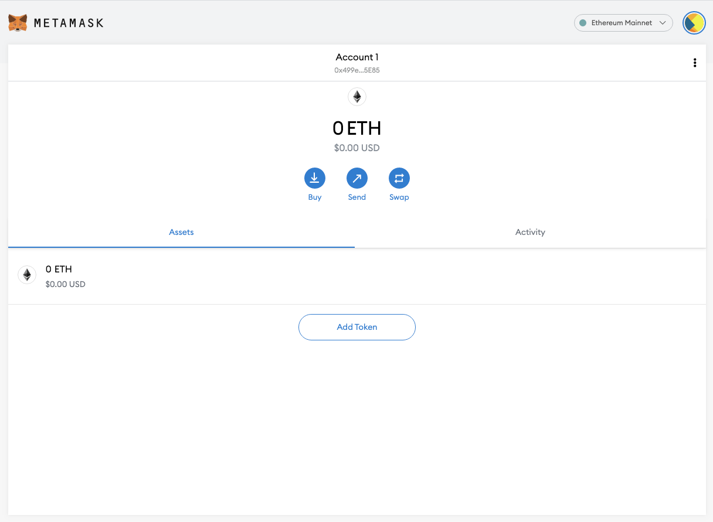

# Using MetaMask

This guide outlines steps of connecting MetaMask wallet to a self-run Clover standalone node in order to send tokens between accounts. You can interact with Clover in two ways: using Substrate RPC endpoints, or by using Web3-compatible RPC endpoints. The latter is currently being served from the same RPC server as the Substrate RPCs. In this tutorial, we will use Web3 RPC endpoints to interact with Clover.

### Install MetaMask Chrome Extension 

First, we start with the [MetaMask](https://metamask.io/) installation from the Chrome Store. After downloading, installing and initializing the extension, follow the "Get Started" guide. Here, you need to create a wallet, set a password, and store your secret backup phrases \(this gives direct access to your funds, so make sure that you store these phrases in a secure place\). Once completed, please import the development account:

The details for the pre-funded development account for standalone build are as follows:

* Private key: `0xa504b64992e478a6846670237a68ad89b6e42e90de0490273e28e74f084c03c8`
* Public address: `0xe6206C7f064c7d77C6d8e3eD8601c9AA435419cE`

On the import page, select “Private Key” and paste the key here:

You should end up with an imported “Account 2” that looks like this:

### Connect to the Local Clover Node 

Now let’s connect MetaMask to your locally running Clover node, which should be producing blocks now:

In MetaMask, navigate to Settings -&gt; Networks -&gt; Add Network and fill in the following details:

* Network Name: `Clover Dev`
* New RPC URL: `http://127.0.0.1:9933`
* ChainID: `1337`
* Symbol \(Optional\): `CLV`

Hit "save" and exit the network settings page, now MetaMask should be connected to the local Clover standalone node via its Web3 RPC, and you should be able to see the Clover dev account with a balance of 10,000,000 CLV.

### Initiating a Transfer 

Let’s try sending some tokens with MetaMask.

For simplicity, let's transfer from this dev account to the account we just created while setting up MetaMask. Hence, we can use the “Transfer between my accounts” option. Let’s transfer 100 tokens and leave all other settings as default \(The token name may be changed to ETH when you re-login Metamask,  that is OK for development purpose,  later we can switch to Clover wallet to make it displayed correctly\):

Confirm the transaction:

Once you have submitted the transaction, you will see it “pending” until it is confirmed, as shown in the following image:

Note that Account 2 balance has been decreased by the amount sent plus gas fees. Go back to Account 1 and you will see the 100 tokens sent just arrived:

