# Using Remix

This guide shows how to create and deploy a Solidity-based smart contract to a Clover standalone node using the [Remix IDE](https://remix.ethereum.org/). 

Remix is one of the most popular Solidity IDE used to write, compile and debug Solidity code. With Clover’s Ethereum compatibility features, Remix can be used directly with a Clover node.

This guide assumes that you have a running local Clover node running in `--dev` mode, and that you have a [MetaMask](https://metamask.io/) installation configured to use this local node. If you don't know how to do it, you can find instructions for running a local Clover node [here](https://clover-network.gitbook.io/portal/quick-start/local-node/setting-up-a-node) and to connect MetaMask to it [here](https://clover-network.gitbook.io/portal/quick-start/local-node/using-metamask).

### Checking Prerequisites <a id="checking-prerequisites"></a>

We assume you have followed the guides above, and have a local Clover node producing blocks. It should look like this:


And you should have installed MetaMask connected to your local Clover dev node. You should have at least one account that has a balance. It should look like this \(expanded view\):


### Getting Started with Remix <a id="getting-started-with-remix"></a>

Now that we can start with Remix to exercise some advanced functionalities in Clover.

To launch Remix, you need to navigate to [https://remix.ethereum.org/](https://remix.ethereum.org/). In the main screen, select Solidity to configure Remix for Solidity development, then navigate to the File Explorers view:

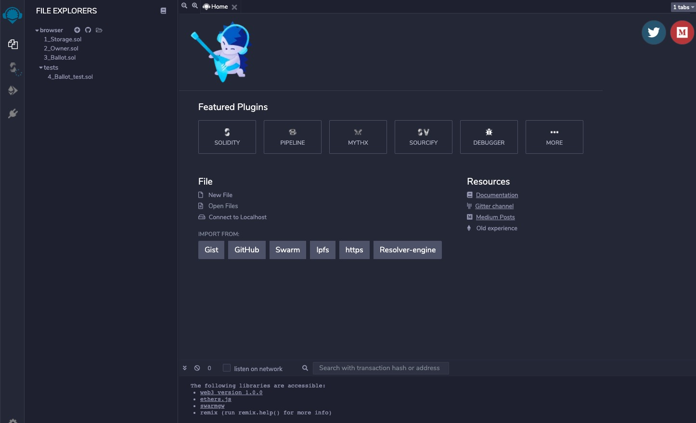

Now we can create a new file to save the Solidity smart contract. Click the "+" button under "File Explorers" at the top left. Give it a name "MyToken.sol" in the popup box.

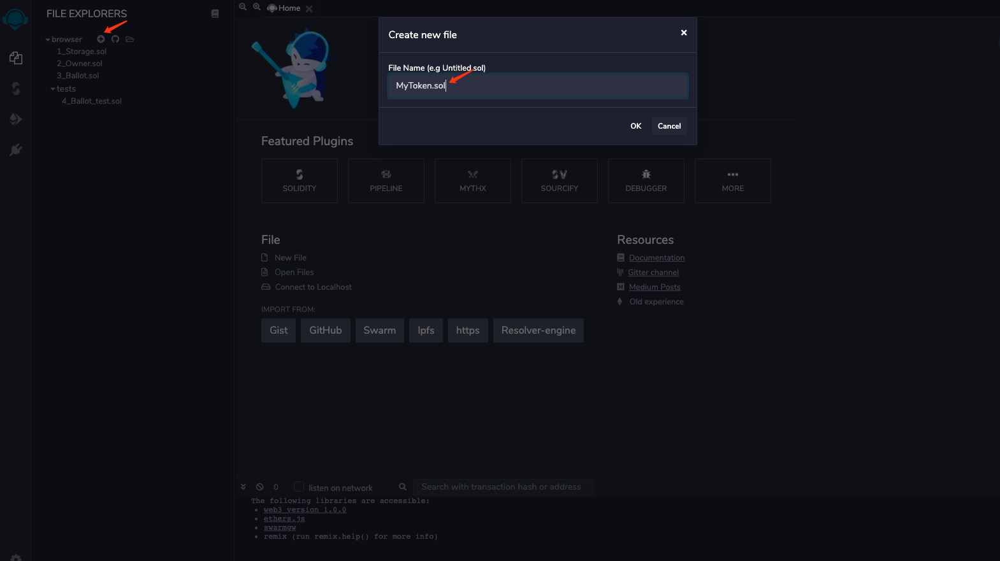

Now paste the following smart contract code into the editor tab on the right side:

```go
// SPDX-License-Identifier: MIT
pragma solidity ^0.6.2;

import "https://github.com/OpenZeppelin/openzeppelin-contracts/blob/v3.3.0/contracts/token/ERC20/ERC20.sol";

contract Token is ERC20 {

    constructor (uint256 initialSupply) public ERC20("MyToken", "ABC") {
        _mint(msg.sender, initialSupply);
    }
}
```

This is a simple ERC-20 contract based on the current Open Zeppelin ERC-20 template. It creates MyToken with symbol ABC and mints the entirety of the initial supply to the creator of the contract.

Now the editor should look like this:

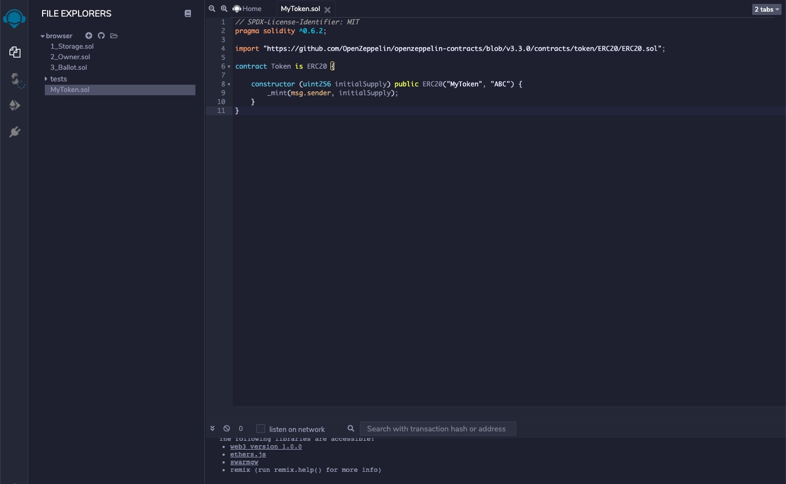

Now navigate to the compile sidebar option first and then click the “Compile MyToken.sol” button at the bottom left:

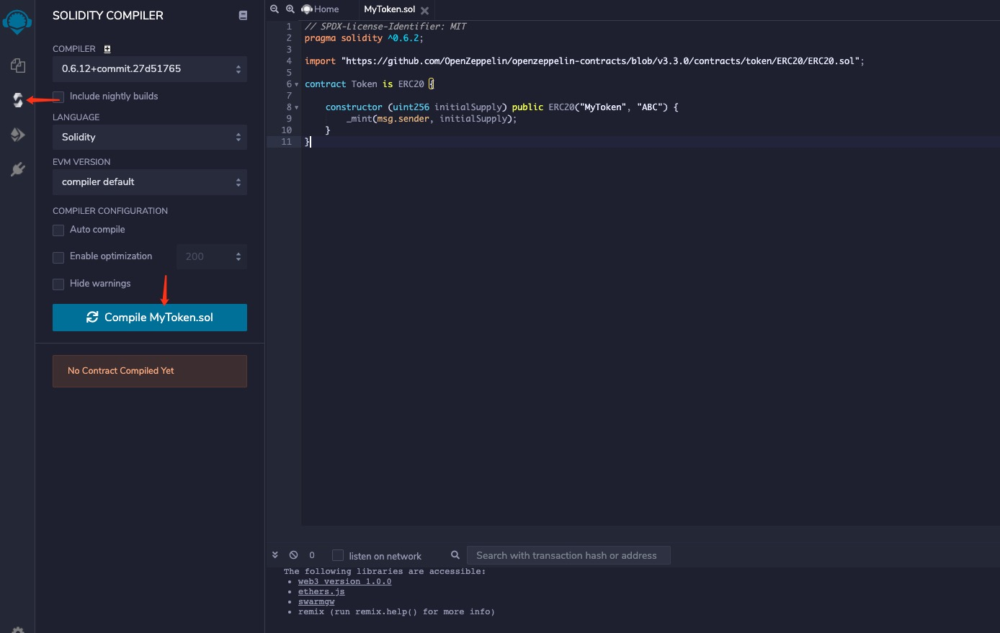

You will see Remix download all of the Open Zeppelin dependencies and compile the contract.

### Deploying a Contract to Clover Using Remix <a id="deploying-a-contract-to-moonbeam-using-remix"></a>

Now we can deploy the contract by navigating to the Deployment sidebar option. You need to change the topmost “Environment” dropdown from “JavaScript VM” to “Injected Web3” which tells Remix to use the MetaMask injected provider, which will point it to your Clover standalone node. As soon as you select this you will be prompted to allow Remix to connect to your MetaMask account.

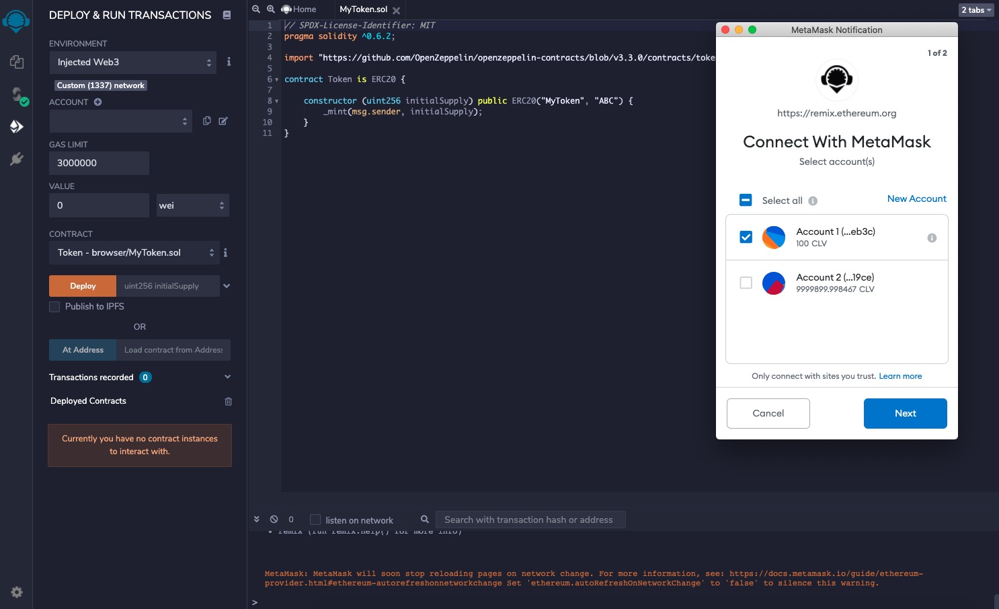

Press “Next” in Metamask to allow Remix to access the selected account.

Back on the Remix side, you should see the account to be used for deployment as the one that is managed by MetaMask. Next to the Deploy button, let’s specify an initial supply of 5M tokens. Since this contract uses the default of 18 decimals, the value to put in the box is `5000000000000000000000000`.

Once you have entered this value hit the Deploy button.

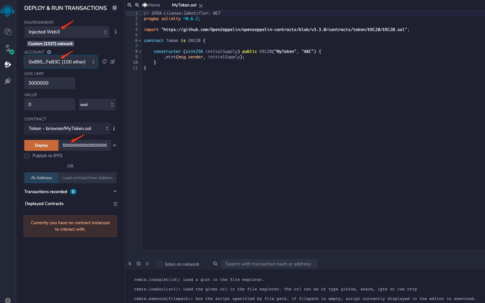

You will be prompted in MetaMask to confirm the contract deployment transaction.

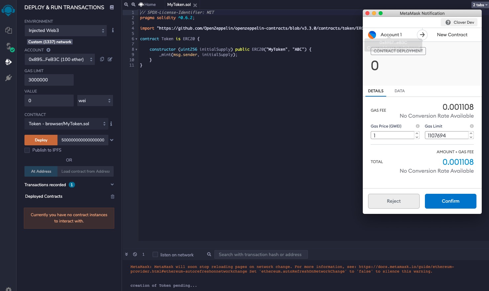

After you press confirm and the deployment is complete, you will see the transaction listed in MetaMask and the contract will appear under Deployed Contracts in Remix.

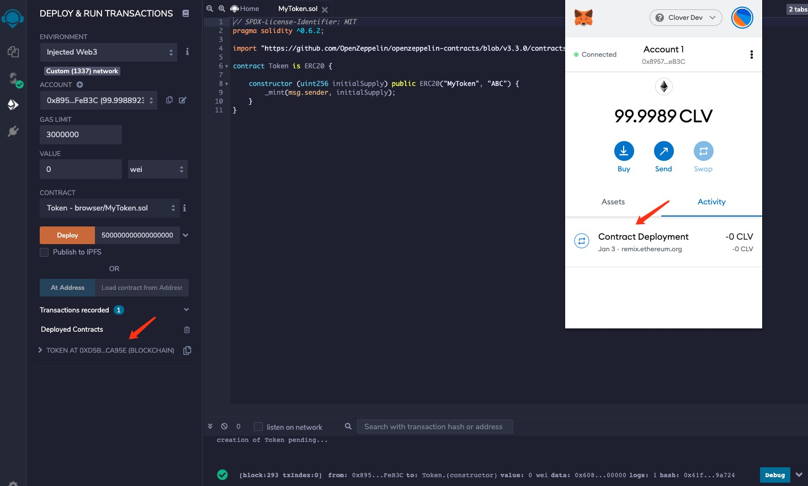

Once the contract is deployed, you can interact with it from within Remix.

Drill down on the contract under “Deployed Contracts.” Clicking on name, symbol, and totalSupply should return “MyToken,” “ABC,” and “5000000000000000000000000” respectively. If you copy the address from which you deployed the contract, and paste it into the balanceOf field, you should see the entirety of the balance of the ERC20 as belonging to that user. Also copy the contract address by click the button next to the contract name and address.

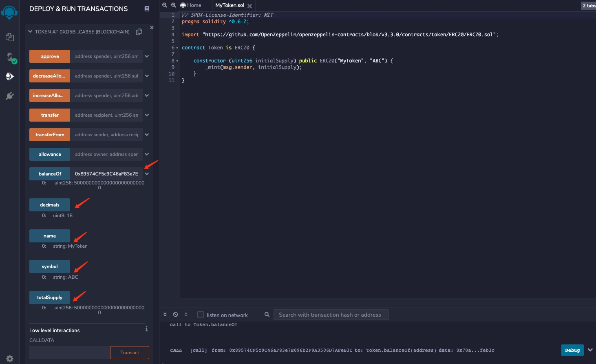

### Interacting with a Clover-based ERC-20 from MetaMask <a id="interacting-with-a-moonbeam-based-erc-20-from-metamask"></a>

Now, open MetaMask to add the newly deployed ERC-20 tokens. Before doing so, make sure you have copied the contract's address from Remix. Back in MetaMask, click on “Add Token” as shown below. Make sure you are in the account that deployed the token contract.

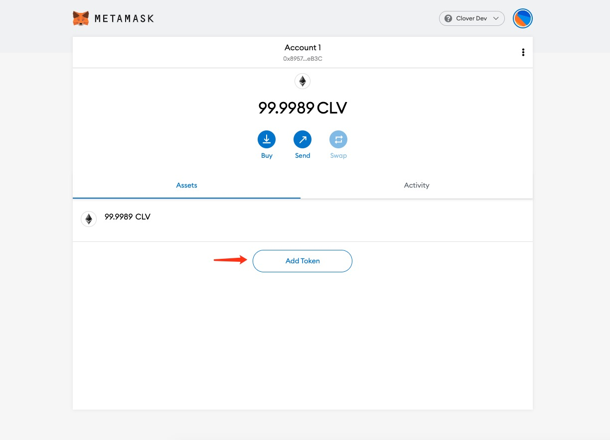

Paste the copied contract address into the “Custom Token” field. The “Token Symbol” and “Decimals of Precision” fields should be automatically populated.

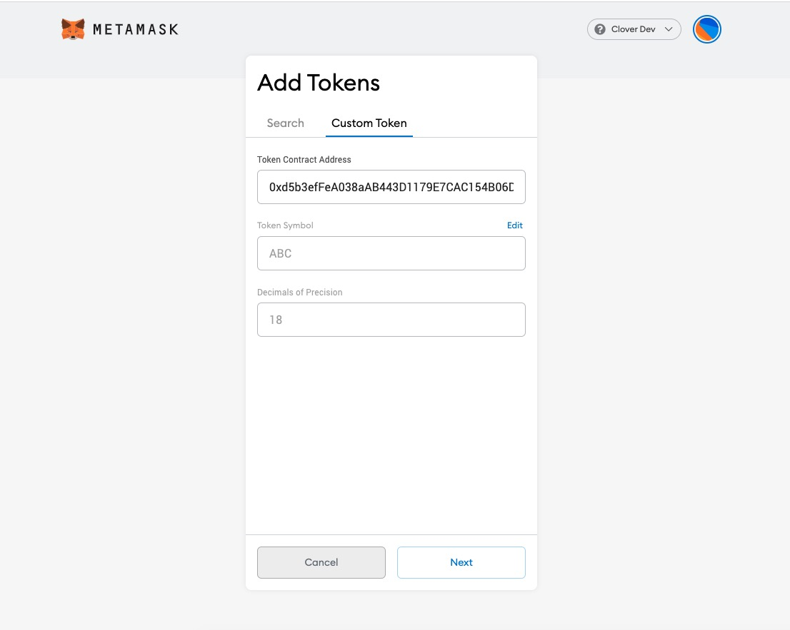

After hitting “Next,” you will need to confirm that you want to add these tokens to your MetaMask account. Hit “Add Token” and you should see a balance of 5M MyTokens in MetaMask:

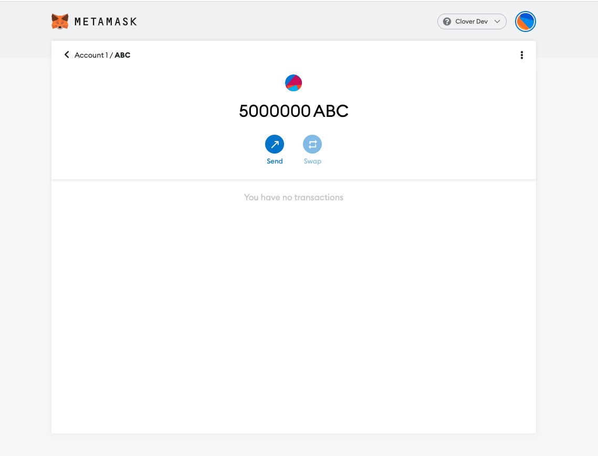

Now we can send some of these ERC-20 tokens to the other account that we have set up in MetaMask. Hit “send” to initiate the transfer of 500 MyTokens and select the destination account.

After hitting “next,” you will be asked to confirm \(similar to what is pictured below\).

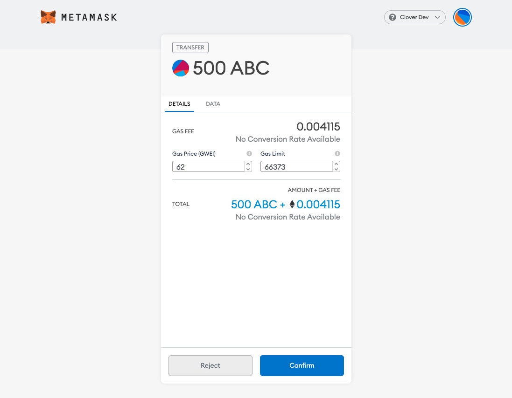

Hit “Confirm” and, after the transaction is complete, you will see a confirmation and a reduction of the MyToken account balance from the sender account in MetaMask:

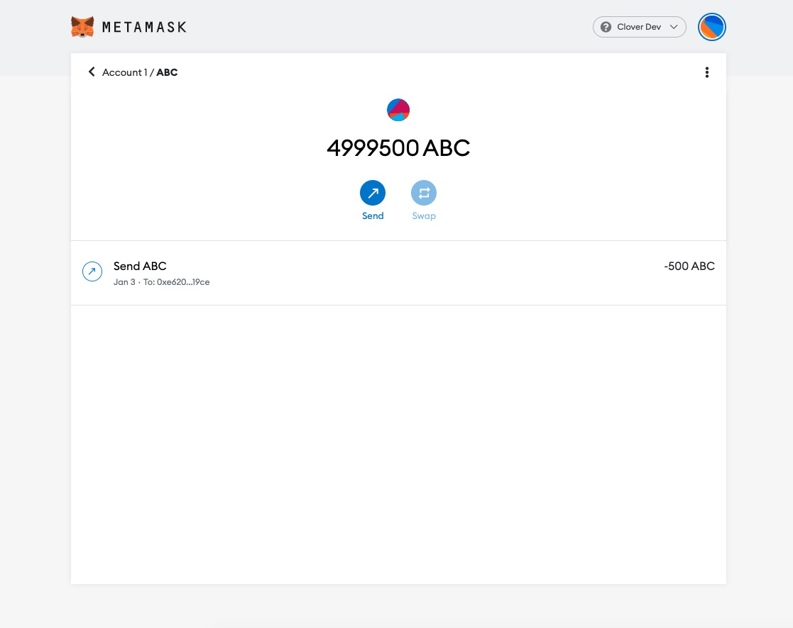

If you own the account whom you send the tokens to, you can add the token asset as well to verify that the transfer arrived.

