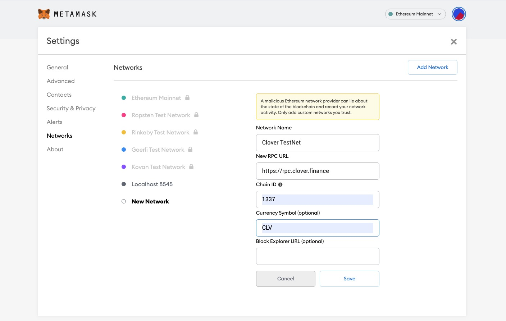
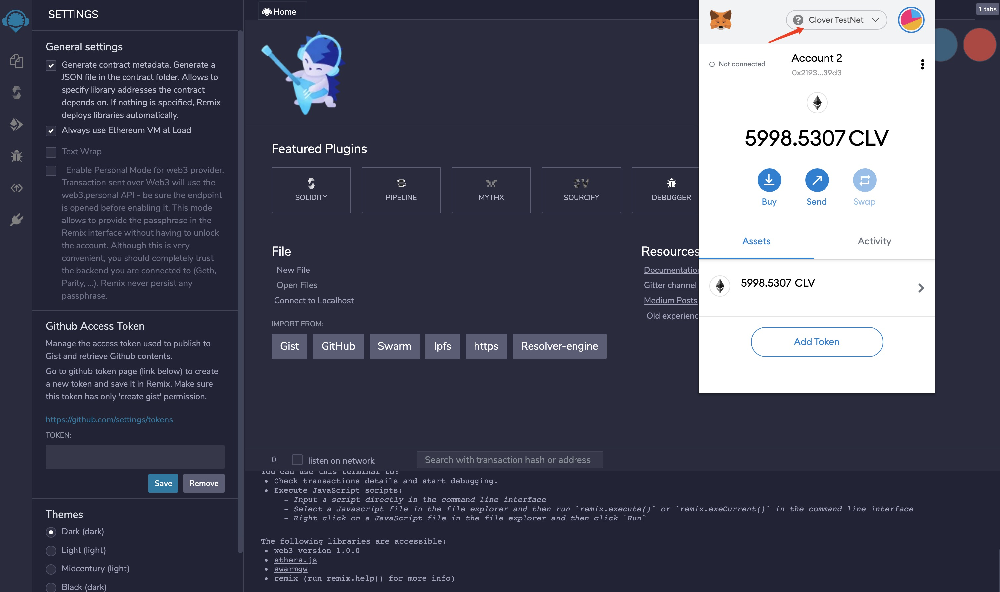

# Test Net

## Clover Test Net

Please refer to the following details for Clover Test Net:

* Network Name: `Clover TestNet`
* RPC URL: 
  * `https://rpc.clover.finance` 
  * `https://rpc-2.clover.finance` 
  * `https://rpc-3.clover.finance`
* Web Socket URL:
  *  `wss://api.clover.finance`
  * `wss://api-2.clover.finance`
  * `wss://api-3.clover.finance`
* ChainID: `1337`
* Symbol \(Optional\): `CLV`

## Using MetaMask for Test Net

In MetaMask, navigate to Settings -&gt; Networks -&gt; Add Network and fill in the above details:



Then the MetaMask can connect to Clover Test Net. You can apply CLV for test via the faucet [http://faucet.clovernode.com/](http://faucet.clovernode.com/)

## Using Remix for Test Net

Make sure your MetaMask is connected to Clover Test Net as described above.  The screen shot is as follows:



## Connect to Clover Test Net

If you want to set up a local node, which can connect to Clover Test Net, please use the following command to start your local node:

```bash
./target/release/clover --chain specs/clover-cc1-raw.json --port 30333 --ws-port 9944 --rpc-port 9933  --name myNode --rpc-cors=all --rpc-methods=Unsafe --validator --unsafe-ws-external --unsafe-rpc-external
```

