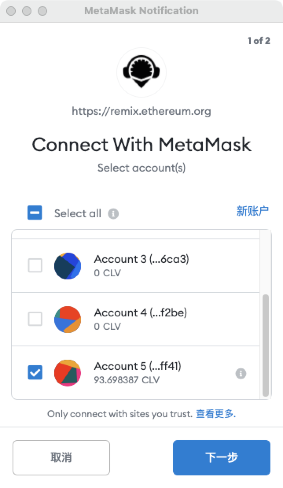
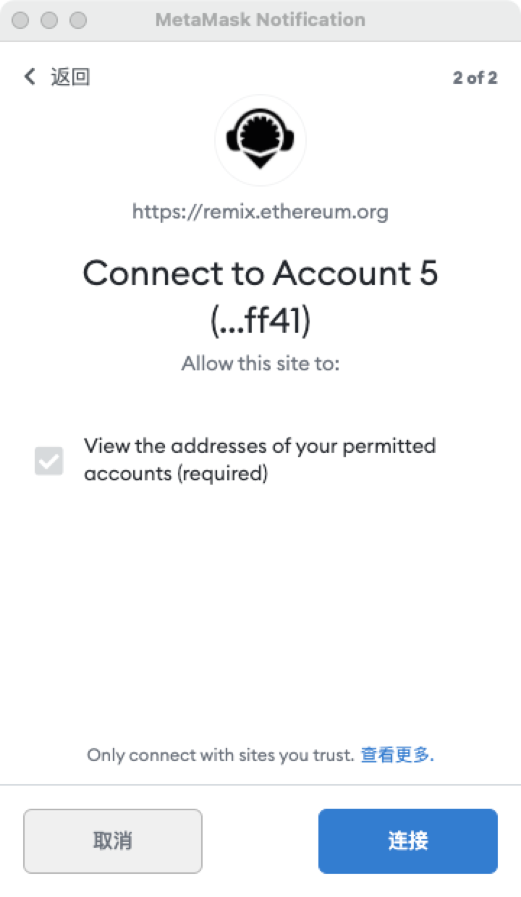

# Remix

Deploys a CIP20 smart contract with a message, and renders it in the front-end. You can interact with the smart contract easily!

This dapp implements a "Hello World" style application that echoes a message passed to the contract to the front end. This tutorial is intended to be followed using the online IDE available at [Remix IDE](https://remix.ethereum.org/).

### Setting up [Remix IDE](https://remix.ethereum.org/) 

* Remix is an online IDE to develop smart contracts.
* You need to choose Solidity Compiler and Deploy and Run Transactions.

* Go to File Explorers, And Create a new file, Name it MegaCoin.sol
* Copy/Paste the Smart contract below into the newly created file `MegaCoin.sol`

## The smart contract 

* Create new contract CIP20Token.sol and copy contract code from the cip20 token template here
* Modify “name”, “symbol”, “decimals” and “totalSupply” according to your requirements.

The first line, `pragma solidity ^0.5.16` specifies that the source code is for a Solidity version greater than 0.5.16. [Pragmas](https://solidity.readthedocs.io/en/latest/layout-of-source-files.html#pragma) are common instructions for compilers about how to treat the source code \(e.g., pragma once\).

A contract in the sense of Solidity is a collection of code \(its functions\) and data \(its state\) that resides at a specific address on the Ethereum blockchain. Learn more about the [constructor](https://solidity.readthedocs.io/en/latest/contracts.html#constructor) and [memory](https://solidity.readthedocs.io/en/latest/introduction-to-smart-contracts.html#storage-memory-and-the-stack) in the docs.

### Compile Smart Contract 

* Step1: Click button to switch to compile page
* Step2: Select “CIP20Token” contract
* Step3: Enable “Auto compile” and “optimization”
* Step4: Click “ABI” to copy the contract abi and save it.

Now, We have to deploy our smart contract on Clover Chain Network. For that, we have to connect to web3 world, this can be done my many services like Metamask, Brave, Portis etc. We will be using Metamask. Please follow this tutorial to setup a Metamask Account.

* Open Metamask and select Custom RPC from the networks dropdown
* Go to setting page 

* Add a new network

* Testnet \* ChainID: 1137 \* Symbol: CLV \* Block Explorer: [https://rpc.clover.finance](https://rpc.clover.finance)
* Go ahead and click save
* Copy your address from Metamask
* Head over to [Faucet](http://faucet.clovernode.com/) and request test CLV
* Now, let's Deploy the Smart Contract on Clover Chain
* Select Injected Web3 in the Environment dropdown and your contract

* Accept the Connection Request!

* Once Metamask is connected to Remix, the ‘Deploy’ transaction would generate another metamask popup that requires transaction confirmation.

**Congratulations!** You have successfully deployed a CIP20 Contract. Now you can interact with the Smart Contract. 

